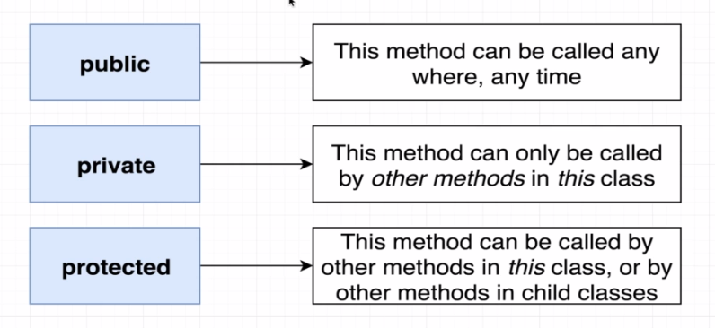

# TypeScript 

- **Type**: An easy way to refer to the different properties and functions that a value has.
- There are 2 categories of types: 
    - **Primitive types**: string, number, null, void, undefined, boolean, symbol
    - **Object types**: functions, arrays, classes, objects
- When to use type annotations (and not rely on type inference):
    - When a function returns the `any` type and we need to clarify the value
    - When we declare a variable on one line then initialize it later
    - When we want a variable to have a type that can't be inferred.
- If all that a function does is throwing an error, then the return type of that function would be `never` meaning this function is never ever going to return anything. Note that such a function is rarely used. 
- **Typed Arrays**: Arrays where each element is some consistent type of value. We use thme any tim ewe need to represent a collection of records with some arbitrary sort order.
- **Tuple**: Array-like structure where each element represents some property of a record.
- Arrays organize a collection of records whereas a tuple usually contains multiple different properties to describe one single thing. Also, inside a tuple we usually mix and match many different types.
- Tuples are rarely used.
- Interface + Classes = How we get really strong code reuse in TS
- **Interfaces**: They create new types (just like `string`, `number`, ...), describing the property names and value types of an object.
- The general strategy for reusable code in TS is to 
    - Create functions that accept arguments that are typed with interfaces
    - Objects/classes can decide to **implement** a given interface to work with a function
- In fact, the interfaces are used as gatekeepers for the functions. If any object needs to use a specific function, it first needs to satisfy the interface. 
- Intance method modifiers and where they're used: 
  

- Using the `private` modifier does not add any layer on security to our app in a way. The only reason we use it is to prevent the incident of some developers not implementing the method safely.
- With the class `fields` you need to either initialize them by setting default values or by settign their values in the `constructor`.
- With TS, we use `classes` heavily. In fact, TypeScript is all about using `classes` and `interfaces` effectively. 
- 