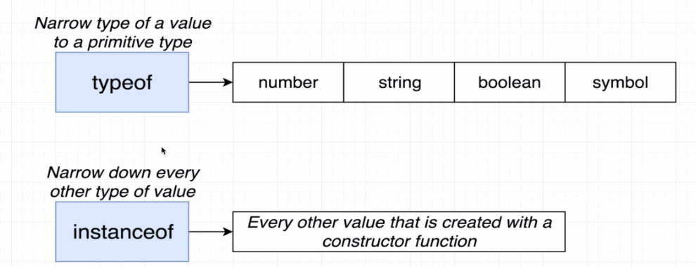
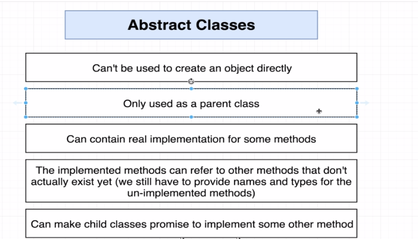
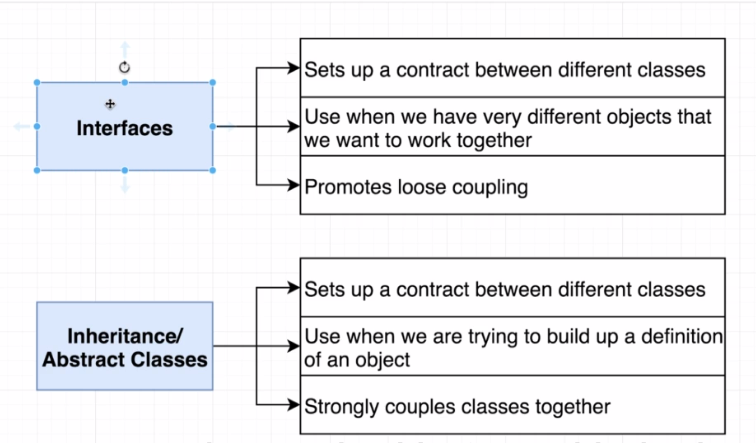

# TypeScript 

- **Type**: An easy way to refer to the different properties and functions that a value has.
- There are 2 categories of types: 
    - **Primitive types**: string, number, null, void, undefined, boolean, symbol
    - **Object types**: functions, arrays, classes, objects
- When to use type annotations (and not rely on type inference):
    - When a function returns the `any` type and we need to clarify the value
    - When we declare a variable on one line then initialize it later
    - When we want a variable to have a type that can't be inferred.
- If all that a function does is throwing an error, then the return type of that function would be `never` meaning this function is never ever going to return anything. Note that such a function is rarely used. 
- **Typed Arrays**: Arrays where each element is some consistent type of value. We use thme any tim ewe need to represent a collection of records with some arbitrary sort order.
- **Tuple**: Array-like structure where each element represents some property of a record.
- Arrays organize a collection of records whereas a tuple usually contains multiple different properties to describe one single thing. Also, inside a tuple we usually mix and match many different types.
- Tuples are rarely used.
- Interface + Classes = How we get really strong code reuse in TS
- **Interfaces**: They create new types (just like `string`, `number`, ...), describing the property names and value types of an object.
- The general strategy for reusable code in TS is to 
    - Create functions that accept arguments that are typed with interfaces
    - Objects/classes can decide to **implement** a given interface to work with a function
- In fact, the interfaces are used as gatekeepers for the functions. If any object needs to use a specific function, it first needs to satisfy the interface. 
- Instance method modifiers and where they're used: 
  

- Using the `private` modifier does not add any layer on security to our app in a way. The only reason we use it is to prevent the incident of some developers not implementing the method safely.
- With the class `fields` you need to either initialize them by setting default values or by settign their values in the `constructor`.
- With TS, we use `classes` heavily. In fact, TypeScript is all about using `classes` and `interfaces` effectively. 
- You can use typescript decalaration file of a package as the documentation of the package. To do so, click on the package name while holding ctrl key. 
- When adding packages to your project remember not expose every method or property of the package in your app entry point file (like `index.ts`). Instead create a custom class that only use and expose the parts of the package that you need.
- Remember to use the `protected` access modifier before an abtract class `constructor` mathod. It's to prevent direct instantiation of abstract base classes and ensure that only subclasses can instantiate them.
- In TS, a single value can have multiple different types. For example, an instance of class `User` is of type `User` and also if it satisfy an `interface` then it's of type of that interface too.
- Interfaces let us invert dependency between a custom class (or function) and the classes that are going to use the custom class. Using interfaces, we can define the set of rules that a class need to abide by in order for it to be able to use our custom class. In other words, our custom class (or function) does not need to worry about who is going to use it. It would be as generic as possible. 
- In TS, the big killer feature is the interplay between classes and interfaces. 
  

- The 3 main concepts we've learned about TS so far: Inside `index.ts` we want to restrict the API surface area. We used interfaces to setup a dependency between the type and various classes. We can help TS put errors in the correct location by using the `implements` clause on classes.
- When using union type operator, we're not only restricting the properties that the value can have but also we are restricting the operations that can be done on one side of the union. For example, in `value: string | number[]` we know that an array of numbers supports indexing but because of the union type, `value` cannot support writing to indexes as it's not supported on the `string` type. 
- When narrowing type of a value use the `typeof` operator and `instanceof` for the following values. Other usages of `typeof` and `instanceof` would not work as type guards in TS. 

  

- After `instanceof` we use the constructor function of whatever type we're checking against. For example, in `this.collection instanceof Array`, `Array` is the constructor function. 
- Interfaces are useful but not just for specifying a type but because they are used to define a **contract** between classes.
- It's important to note that interfaces do nothing to guarantee that the implementation of the methods are correct. As longs as the methods exist and have the correct type, interfaces are happy. 
  

- Features of `abstract` classes:
  

- Usage of abstract classes vs interfaces: whenever the classes that are going to have a contract with each other are not really related to each other, for example user class and map class, then interfaces are used to set the contract. However, if the objects are closely related to each other, for example sorter and collection classes, then an abstract class is a better alternative:

  

- The only purpose of using **enums** is just to signal other engineers that this is a collection of very closely related values. It can also be used as a `Type`. 
- In order to figure out if it's a good idea to use enums ask yourself if you already know all the possible values beforehand (you don't need for example to send a network request to find out about values) and the values are actually a set of fixed values. Also, note that enums are usually used on an small set values (about maximum ~15 values). 

